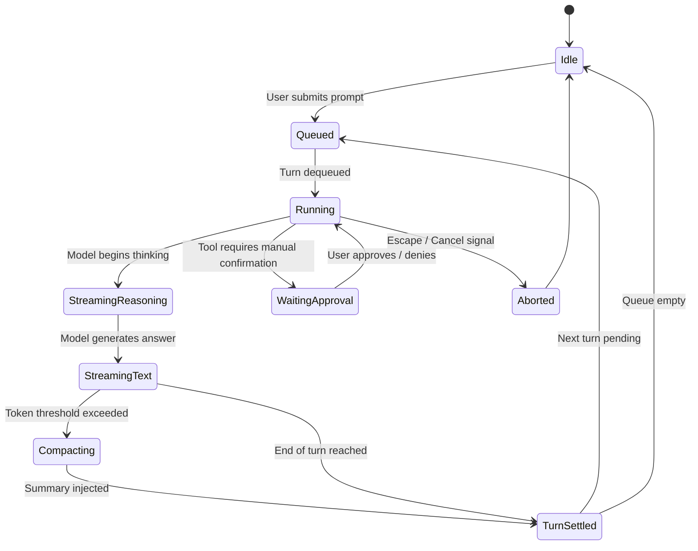

# Technical Specification: rho & lota

This document outlines the architectural design, execution model, component boundaries, and interface protocols of the **`rho`** agentic coding harness and its companion desktop interface, **`lota`**.

---

## 1. System Overview & Vision

`rho` is a fast, minimal, single-binary agentic coding CLI and engine implemented in Rust on top of **Rig 0.42**. `lota` is its official native desktop pair-programming companion built with **Tauri 2.0**, **React 19**, **TypeScript**, **Tailwind CSS**, and **Zustand**.

### High-Level Goals
- **Sub-millisecond Local Overhead**: Zero-overhead local loop, streaming reasoning tokens and text directly over native async channels.
- **Robust Tool Execution**: Deterministic file system operations, sandboxed bash execution, web extraction, and dynamic MCP (Model Context Protocol) integration.
- **Unified Credential & Configuration Layer**: A single shared vault (`~/.config/rho/auth.json` and `~/.config/rho/config.toml`) powering both the CLI and Desktop UI seamlessly.
- **Strict Lint & Production Quality**: Zero placeholders, zero compiler warnings under `-D warnings`, and clean cross-platform compatibility (Windows, macOS, Linux).

---

## 2. Repository & Workspace Topology

```text
rho/
├── Cargo.toml                       # Workspace root manifest (v0.1.7)
├── src/                             # rho CLI harness application
│   ├── cli/                         # CLI parser, interactive REPL, auth commands
│   ├── platform/                    # Host OS clipboard, signals, process management
│   ├── repl/                        # TUI editor, status footer, live event pump
│   └── ui/                          # Terminal renderers, interactive widgets
├── crates/
│   ├── rho-engine/                  # Core agent engine, Rig integration, providers, tools
│   │   ├── src/auth/                # Secure credential resolver & store
│   │   ├── src/engine/              # Agent runner, context memory, compaction loop
│   │   ├── src/mcp/                 # Model Context Protocol stdio client
│   │   ├── src/plugin/              # Host & daemon hook plugin architecture
│   │   ├── src/provider/            # Provider factory (Anthropic, OpenAI, Gemini, Ollama)
│   │   └── src/tools/               # Built-in tools (read, write, edit, bash, search, fetch)
│   ├── rho-harness-core/            # Shared types, config, session manager, RPC protocol
│   └── rho-plugin-sdk/              # Public SDK for developing native external plugins
├── lota/                            # Desktop application (Tauri 2.0 + React 19)
│   ├── src-tauri/                   # Rust backend for Tauri
│   │   ├── src/engine_bridge.rs     # Stateful RPC engine & multi-provider streaming client
│   │   ├── src/workspace_cmd.rs     # Native filesystem crawler & workspace reader
│   │   └── src/lib.rs               # Tauri IPC command registration & window handlers
│   └── src/                         # Frontend React application
│       ├── components/              # Chat feed, workbench, settings, customisation, cards
│       ├── hooks/                   # Engine RPC hook, prompt queue, shortcuts, drag-and-drop
│       └── store/                   # Zustand stores (session, workspace, provider, theme, ui)
└── tests/                           # Integration and regression test suites
```

---

## 3. Core Engine & Execution Architecture

### 3.1 Finite State Machine (FSM)
The agent runtime cycles through a strictly managed lifecycle:



### 3.2 Context & Memory Management
- **Context Window Monitoring**: Telemetry tracks input/output tokens against model context limits.
- **Micro-Compaction**: When token capacity crosses configurable thresholds (default: 80%), earlier turns are summarized into a concise memory checkpoint, preserving active system directives and recent file modifications.
- **Session DAG Tree**: All conversational turns, branching tool calls, and forks are persisted as nodes in `~/.config/rho/sessions/<session_id>.json`.

---

## 4. Tool System & Protocol Normalization

### 4.1 Built-in Core Tools
`rho` provides 6 essential, safety-guarded built-in tools:

| Tool | Purpose | Key Safeguards |
|---|---|---|
| `read` | Read file contents from disk | Enforces line offset, limit caps, and UTF-8 byte boundary truncation. |
| `write` | Create or replace entire files | Automatically creates missing directories; enforces protected path exclusions. |
| `edit` | Precise substring replacement | Requires unique match validation; fails atomically on ambiguity. |
| `bash` | Execute shell commands | Timeout enforcement, stream chunking, and tail-preserving output truncation. |
| `search` | Web search queries | Rate-limiting, domain filtering, and structured markdown summaries. |
| `fetch` | URL content scraper | Private IP/localhost blocking, content size limits, and HTML-to-markdown extraction. |

### 4.2 Schema Normalization for Provider Compliance
Different LLM providers enforce distinct schema rules for tool parameter definitions:
- **Anthropic / OpenAI**: Standard JSON Schema `draft-07`.
- **Google Gemini**: Requires normalized schemas without unsupported keywords (`$schema`, `definitions`, `additionalProperties: false`) and expects compliant parameter definitions.

---

## 5. Multi-Provider AI Matrix & Authentication

### 5.1 Provider Architecture
`rho` and `lota` connect to all major frontier models through a unified abstraction:

```text
┌────────────────────────────────────────────────────────────────────────┐
│                          Unified Provider Layer                        │
├───────────────┬────────────────┬───────────────────────┬───────────────┤
│ Cloud API Key │ Local LLMs     │ Subscription OAuth    │ Custom OpenAI │
├───────────────┼────────────────┼───────────────────────┼───────────────┤
│ • Anthropic   │ • Ollama       │ • ChatGPT (PKCE)      │ • Acme / vLLM │
│ • OpenAI      │   (localhost)  │ • Copilot (Device)    │ • OpenRouter  │
│ • Gemini      │ • vLLM         │                       │ • LiteLLM     │
│ • DeepSeek    │                │                       │ • LocalAI     │
│ • Groq        │                │                       │               │
└───────────────┴────────────────┴───────────────────────┴───────────────┘
```

### 5.2 Single Source of Credential Truth
Both the CLI and Desktop UI share a single credential vault:
- **Location**: `~/.config/rho/auth.json` (Windows: `%USERPROFILE%\.config\rho\auth.json`)
- **Precedence**:
  1. CLI Flags (`--model`, `--provider`)
  2. Environment Variables (`GEMINI_API_KEY`, `ANTHROPIC_API_KEY`, `OPENAI_API_KEY`)
  3. Persistent Vault (`auth.json`)

---

## 6. Desktop UI Architecture (`lota`)

### 6.1 Layout Blueprint
```text
┌────────────────────────────────────────────────────────────────────────────────────────┐
│ [C-TITLEBAR] Frameless Drag Area, Workspace Selector, Window Controls (— ▢ ✕)          │
├─────────────────────┬────────────────────────────────────────────┬─────────────────────┤
│ [C-SIDEBAR]         │ [C-MAIN-VIEW] App.tsx Router               │ [C-WORKBENCH]       │
│                     │                                            │                     │
│ [New Agent]         │ Views:                                     │ Split-pane tabs:    │
│ [New Chat]          │ • Chat (Virtualized Feed + Prompt Input)   │ • Visual Diff       │
│                     │ • Customise (Personas, Rules, Skills, MCP) │ • File Preview      │
│ Accordions:         │ • Artifacts & Presentation Deliverables    │ • Thinking Log      │
│ • Agents >          │ • Automations & Scheduled Workflows        │ • Raw JSON Inspect  │
│ • Chats >           │ • Settings Hub (9-Tab Configuration)       │                     │
│                     │                                            │                     │
├─────────────────────┴────────────────────────────────────────────┴─────────────────────┤
│ [C-STATUSBAR] Working Dir (cwd) | Git Branch | Active Model | Token Usage Gauge        │
└────────────────────────────────────────────────────────────────────────────────────────┘
```

### 6.2 Key UI Features
- **Virtualized Message Feed**: 60 FPS rendering using `@tanstack/react-virtual` capable of handling 10,000+ turn message histories without DOM degradation.
- **Copy/Paste Usability**: Universal 1-click copy buttons for code blocks, message responses, and full selection highlight.
- **Live Stream Rendering**: Distinct collapsible reasoning/thinking blocks separated from the synthesized response markdown.
- **Interactive Artifacts**: Inline live rendering of HTML widgets, SVG graphics, Mermaid diagrams, Draw.io vectors, and Presentation slide decks.

---

## 7. IPC & Event Protocol (`rho://event`)

Communication between the Tauri Rust backend and the React UI occurs over a structured asynchronous RPC channel:

### 7.1 RPC Request Commands
- `Prompt { message }`: Dispatches user turn into the execution loop.
- `Abort`: Halts active generation and releases streaming handles.
- `Steer { message }`: Dynamically injects mid-generation guidance.
- `ToolResponse { approval_id, decision }`: Responds to interactive tool approval prompts.
- `SetModel { provider, model }`: Switches active model engine dynamically.
- `Compact { instructions }`: Forces immediate context compaction.

### 7.2 RPC Telemetry Events (`rho://event`)
- `SessionStart`: Emitted when an execution session initializes.
- `TurnStart`: Emitted at the start of a model prompt turn.
- `ReasoningChunk`: Streams intermediate model reasoning tokens in real-time.
- `TextChunk`: Streams final response markdown text chunks.
- `ToolCallStart` / `ToolCallResult`: Signals tool invocations, inputs, execution durations, and outputs.
- `UsageUpdate`: Reports live input/output token counts, spend estimates, and context percentage.
- `TurnEnd`: Concludes turn with status reason (`end_turn`, `aborted`, `error`).

---

## 8. Quality, Lint & Performance Mandates

1. **Strict File Size Guidance**: Target ~150 lines per implementation file. Treat growth beyond 150 lines as a signal to separate natural architectural concerns.
2. **Zero Clippy Warnings**: Code must compile cleanly with `cargo clippy --all-targets -- -D warnings`. No suppression attributes (`#[allow(...)]`) are permitted.
3. **Network Hygiene**: All HTTP clients must configure `.no_proxy()` and use `rustls-tls-webpki-roots` to avoid platform IPC lockups.
4. **Tokenization Efficiency**: Re-use static tokenizers and regex matchers via `LazyLock` / singletons.
